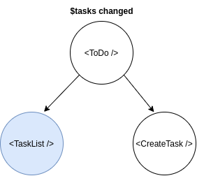
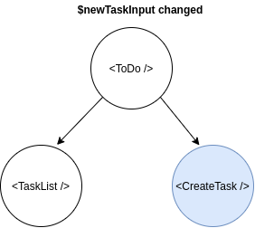

# Оптимизация производительности приложения.

Данная статья рассказывает о принципах и приемах оптимизации производительности React приложений. 
Все примеры кода приводятся на эффекторе, однако, большую часть описанных приемов легко применить к связке React c любым стейт-менеджером. 


## Основные принципы.

В большинстве случаев оптимизация производительности сводится к оптимизации процесса ререндеринга приложения. Безусловно, React весьма экономично ререндерит реальный DOM обновляя только то что требуется (или нативные представления в случае React Native). 

Однако, пересчет виртуального DOM (построение нового дерева React элементов, вычисление fiber-нод) порой может быть весьма затратным (везде ниже под ререндерингом мы подразумеваем именно этот процесс, исключая непосредственно коммит в DOM). 

Чем масштабнее и чаще происходит ререндеринг - тем хуже. 
Если одно действие пользователя инициирует целый ворох ререндеров затрагивающих большое количество элементов - приложение ощущается менее отзывчивым, падает частота кадров, пользовательский ввод становится медленным и неприятным, UX ухудшается. 

Эта проблема острее всего стоит в React Native, где все обновления представления должны сериализовываться и проходить через bridge, а ререндеринг нагружает JS тред (который у нас к сожалению только один), снижая частоту кадров. Но и для веба всё это тоже весьма актуально. 


Оптимизируя React приложение нужно держать в голове следующие вещи:

1. При возникновении ререндеринга в любой из нод, React пересчитывает всё поддерево 
2. Остановить нисходящий ререндер можно только посредством pure-компонентов (React.memo для функциональных компонентов). Для компонентов, обернутых в React.memo React производит сравнение каждого prop с точностью до ссылок (через ===), и исполняет render функцию только в том случае, если хотя бы один пропов изменился. 
3. Каждый стор, подключенный через useStore вызывает ОТДЕЛЬНЫЙ ререндер
4. Обновление эффектор состояния в большинстве случаев очень "дешевое". Ререндеринг - на порядок дороже.


### Больше контейнеров богу контейнеров. 

Создавайте больше небольших компонентов-контейнеров со своим кусочками состояния. Опускайте состояние вниз по дереву элементов. 

Рассмотрим компонент TODO листа в который можно добавлять задачи (стайледы и модель упущены для краткости)

```tsx
import { useStore } from "effector-react"
import { Task, Input, Button } from "@/ui"
import { $tasks, $newTaskInput, onInput, createTask } from "./model"


const Todo = () => {
  const tasks = useStore($tasks)
  const newTaskInput = useStore($newTaskInput)

  return (
    <Wrap>
      <TasksWrap>
        {tasks.map((task) => <Task key={task.id} task={task} />)}
      </TasksWrap>
      <InputWrap>
        <Input
          value={newTaskInput}
          onChange={onInput}
        />
        <Button label="Create task" onClick={createTask} />
      </InputWrap>
    </Wrap>
  )
}
```

При любом изменении как $tasks, так и $newTaskInput будет происходить ререндеринг всего компонента. При такой реализации ререндер на каждый ввод символа (!) происходит ререндеринг всего списка задач.
Чем больше список задач, и чем тяжелее сами компоненты задач - тем больше будет лагать пользовательский ввод. Давайте оптимизируем этот кейс, разбив на компоненты-контейнеры по которым раскидаем состояние:

```tsx

const TasksList = () => {
  const tasks = useStore($tasks)

  return (
    <TasksWrap>
      {tasks.map((task) => <Task key={task.id} task={task} />)}
    </TasksWrap>
  )
}

const CreateTask = () => {
  const newTaskInput = useStore($newTaskInput)

  return (
    <InputWrap>
      <Input
        value={newTaskInput}
        onChange={onInput}
      />
      <Button label="Create task" onClick={createTask} />
    </InputWrap>
  )
}

const Todo = () => (
  <Wrap>
    <TasksList />
    <CreateTask />
  </Wrap>
)

```

Теперь при изменении $newTaskInput происходит ререндер только небольшого текстового инпута. Аналогично при изменении $tasks ререндерится только список задач (синим обозначены компоненты которые будут ререндерится):





На последнем пункте остановимя чуть подробнее. Предположим, у нас имеется два стора:

```ts
const $items = createStore<Item[]>([])
const $count = 
```


выделяйте контейнеры
комбайн пропов
опустить состояние
React.memo 
useStoreMap
мемоизация