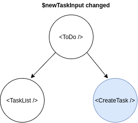
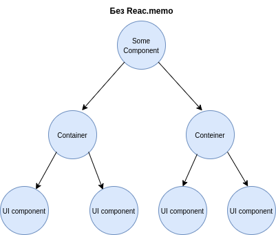
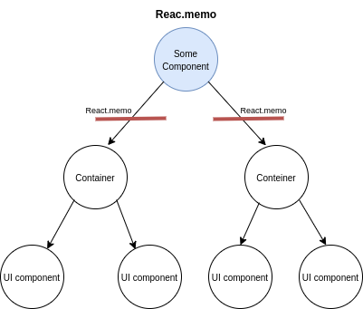

# Оптимизация производительности приложения.

Данная статья рассказывает о принципах и приемах оптимизации производительности React приложений. 
Все примеры кода приводятся на эффекторе, однако, большую часть описанных приемов легко применить к связке React c любым стейт-менеджером. 

Необходимость описанных ниже оптимизаций - это собственно одна из ключевых причин (помимо отделения бизнес логики от представления) по которой стейт-менеджеры вообще сушествуют. 


## Основные принципы.

В большинстве случаев оптимизация производительности сводится к оптимизации процесса ререндеринга. Безусловно, React весьма экономично ререндерит DOM (или нативные представления в случае React Native) обновляя только то что требуется. 

Однако, пересчет виртуального DOM (построение нового дерева React элементов, вычисление fiber-нод) порой может быть весьма затратным (везде ниже под ререндерингом мы подразумеваем именно этот процесс, исключая непосредственно коммит в DOM). 

Чем масштабнее и чаще происходит ререндеринг - тем хуже. 
Если одно действие пользователя инициирует целый ворох ререндеров затрагивающих большое количество элементов - приложение ощущается менее отзывчивым, падает частота кадров, пользовательский ввод становится медленным и неприятным, UX ухудшается. 

Эта проблема острее всего стоит в React Native, где все обновления представления должны сериализовываться и проходить через bridge, а ререндеринг нагружает JS тред (который у нас к сожалению только один), снижая частоту кадров. Но и для веба всё это тоже весьма актуально в ряде случаев. 


Оптимизируя React приложение нужно держать в голове следующие вещи:

1. При возникновении ререндеринга в любой из нод, React пересчитывает всё поддерево 
2. Остановить нисходящий ререндер можно только посредством pure-компонентов (React.memo для функциональных компонентов). Для компонентов, обернутых в React.memo React производит сравнение каждого prop с точностью до ссылок (===), и исполняет render функцию только в том случае, если хотя бы один пропов изменился. 
3. Каждый стор, подключенный через useStore вызывает ОТДЕЛЬНЫЙ ререндер
4. Обновление эффектор состояния в большинстве случаев очень "дешевое". Ререндеринг - на порядок дороже.


### Больше контейнеров богу контейнеров. 

Создавайте больше небольших компонентов-контейнеров со своим кусочками состояния. Опускайте состояние вниз по дереву элементов. 

Рассмотрим компонент TODO листа в который можно добавлять задачи (стайледы и модель упущены для краткости)

```tsx
import { useStore } from "effector-react"
import { Task, Input, Button } from "@/ui"
import { $tasks, $newTaskInput, onInput, createTask } from "./model"


const Todo = () => {
  const tasks = useStore($tasks)
  const newTaskInput = useStore($newTaskInput)

  return (
    <Wrap>
      <TasksWrap>
        {tasks.map((task) => <Task key={task.id} task={task} />)}
      </TasksWrap>
      <InputWrap>
        <Input
          value={newTaskInput}
          onChange={onInput}
        />
        <Button label="Create task" onClick={createTask} />
      </InputWrap>
    </Wrap>
  )
}
```

При любом изменении как $tasks, так и $newTaskInput будет происходить ререндеринг всего компонента. При такой реализации ререндер на каждый ввод символа (!) происходит ререндеринг всего списка задач.
Чем больше список задач, и чем тяжелее сами компоненты задач - тем больше будет инпутлаг. Давайте оптимизируем этот кейс, разбив на компоненты-контейнеры по которым раскидаем состояние (в реальном проекте контейнеры скорее всего будут больше и будут разнесены по разным файлам):

```tsx

const TasksList = () => {
  const tasks = useStore($tasks)

  return (
    <TasksWrap>
      {tasks.map((task) => <Task key={task.id} task={task} />)}
    </TasksWrap>
  )
}

const CreateTask = () => {
  const newTaskInput = useStore($newTaskInput)

  return (
    <InputWrap>
      <Input
        value={newTaskInput}
        onChange={onInput}
      />
      <Button label="Create task" onClick={createTask} />
    </InputWrap>
  )
}

const Todo = () => (
  <Wrap>
    <TasksList />
    <CreateTask />
  </Wrap>
)

```

Теперь при изменении $newTaskInput происходит ререндер только небольшого текстового инпута. Аналогично при изменении $tasks ререндерится только список задач (синим обозначены компоненты которые будут ререндерится):





### Используйте React.memo

Оборачивайте containers и entries в React.memo:

```tsx
import * as React from 'react'

const TasksList = React.memo(() => {
  const tasks = useStore($tasks)

  return (
    <TasksWrap>
      {tasks.map((task) => <Task key={task.id} task={task} />)}
    </TasksWrap>
  )
})
```

Замечательная особенность контейнеров в том что они полностью определяют состояние всего поддерева элементов. Оборачивая их в React.memo мы блокируем нисходящий поток ререндеринга.

На рисунке ниже это отображено визуально (ререндеринг инициируется изменением состояния в "Some Component"):




> **Удобная аналогия** представляйте ререндеринг как нисходящий по дереву компонентов поток воды. Ваша задача минимизировать количество нод которые заполнены водой. React.memo - это "заслонка", блокирующая поток. Когда вы опускаете состояние - вода начинает разливаться ниже. 


### Объединяйте связанное состояние


Предположим, у нас имеется три стора:
```ts
const $products = createStore<Item[]>([])
const $totalPrice = $products.map(
  (products) => products.reduce((acc, product) => acc + product.price, 0)
)
const $count = $products.map((products) => products.length)
```

И в некотором компоненте нам по какой-то причине требуется все три. Если подключить сторы вот так:

```tsx
const Comp = React.memo(() => {
  const products = useStore($products)
  const totalPrice = useStore($totalPrice)
  const count = useStore($count)

  return (
    // ... 
  )
})
```

при изменении $products произойдет три (!) реререндера (useStore превращает стор в локальное состояние). Чтобы получить один нужно объединить связанное состояние посредством combine:

```tsx
const $productsInfo = combine(
  $products,
  $totalPrice,
  $count,
  (products, totalPrice, count) => ({
    products,
    totalPrice,
    count,
  })
)

const Comp = React.memo(() => {
  const { products, totalPrice, count } = useStore($productsInfo)

  return (
    // ... 
  )
})
```

Поступив таким образом мы сведем количество ререндеров до одного. 

> Обратите внимание что здесь речь идет о связанном состоянии, в более широком смысле - о состоянии которое изменяется одновременно. Для независимого состояния эта оптимизация не имеет смысла и его можно подключать через отдельные useStore


### useStoreMap 

Замечательная хука useStoreMap позволяет многократно понизить количество ререндеров при рендеринге списков. 

Рассмотрим пример

```ts
export const $items = createStore<Item[]>([])
export const $selectedItem = createStore<Item | null>(null)
export const selectItem = createEvent<Item>()

$selectItem.on(selectItem, (_, item) => item)
```

```tsx
import { $items, $selectedItem, selectItem } from "./model"
import { Item } from "@/ui"

const ItemsList = React.memo(() => {
  const items = useStore($items)
  const selectedItem = useStore($selectedItem)

  return (
    <>
      {items.map((item) => (
        <Item
          item={item}
          onSelect={selectItem}
          selected={selectedItem === item}
        />
      ))}
    </>
  )
})
```

При такой организации компонентов, при выделении элемента происходит ререндеринг ВСЕГО списка. Что совершенно не рационально. Давайте сделаем контейнер для элемента списка и используем useStoreMap:

```tsx
import { useStoreMap } from 'effector-react'
import { $items, $selectedItem, selectItem } from "./model"
import { Item } from "@/ui"


type ItemContainerProps = {
  item: Item,
  onSelect: (item: Item) => void,
}

const ItemContainer = React.memo(({ item, onSelect }) => {

  const currentItemSelected = useStoreMap({
    store: $selectedItem,
    keys: [item],
    fn: (selectedItem, [item]) => selectedItem === item,
  })

  return (
    <Item
      item={item}
      onSelect={selectItem}
      selected={currentItemSelected}
    />
  )
})

const ItemsList = React.memo(() => {
  const items = useStore($items)

  return (
    <>
      {items.map((item) => (
        <ItemContainer
          key={item.id}
          item={item}
          onSelect={selectItem}
        />
      ))}
    </>
  )
})
```

useStoreMap получает в качестве аргумента стор, массив зависимостей (зависимости могут быть пропсами или локальным состоянием) и функцию-маппер. Результат маппера превращается в локальное состояние. Замечательно то, что ререндеринг произойдет только тогда, когда полученное состояние изменится. И вместо ререндеринга всего списка со всеми его элементами, при выделении элемента будет ререднерится только сам элемент. 


### Мемоизация тяжелых вычислений, мемоизация колбэков.

Данный совет не относится к теме стейт-менеджеров, он актуален для любого React-приложения. 

**До оптимизации**
```tsx

const MyComp = ({ data, anotherData }: Props) => {
  // computeExpensiveValue - какие-то дорогие вычисления
  const someComputedState = computeExpensiveValue(data, anotherData)

  return (
    // верстка
  )
}
```

**После**
```tsx
const MyComp = ({ data, anotherData }: Props) => {
  // computeExpensiveValue - какие-то дорогие вычисления
  const someComputedState = React.useMemo(
    () => computeExpensiveValue(data, anotherData),
    [data, anotherData]
  )
  
  return (
    // верстка
  )
}
```

React.useMemo мемоизирует вычисления, выполняя их тогда и только тогда, когда изменилась одна из зависимостей (которые передаются массивом во втором аргументе). Без использования useMemo вычисления будут производится при каждом рендеринге. 

В некоторых (!) случаях хорошей оптимизацией будет также обернуть в useCallback передаваемый в pure-компонент колбэк:

```tsx
const MyComp = () => {
  const onSomething = useCallback((a) => doSomethind(a, b), [b])


  return (
    <MyPureComponent onSomething={onSomething} />
  )
}
```

Если ваш колбэк не зависит от состояния компонента, того же эффекта можно добиться вынося его в обычную переменную вне компонента:

```tsx
const onSomething = (a) => doSomethind(a)

const MyComp = () => {
  return (
    <MyPureComponent onSomething={onSomething} />
  )
}
```

> Данная оптимизация имеет смысл ТОЛЬКО если колбэк передается в pure-компонент. Если колбэк передается в обычный компонент она полностю лишена смысла так как такой компонент в любом случае будет перерендерен при ререндеринге родителя. 

> **WARNING!** описанные в этом подразделе оптимизации намного менее актуальны, чем все предыдушее. Не применяйте useMemo и useCallback везде подряд. В большинстве случаев это экономия на спичках, которая только снизит читаемость кода
